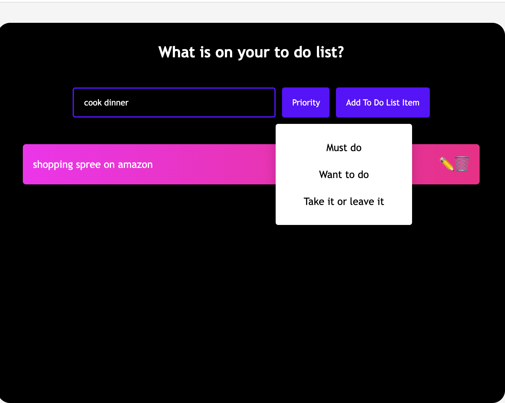
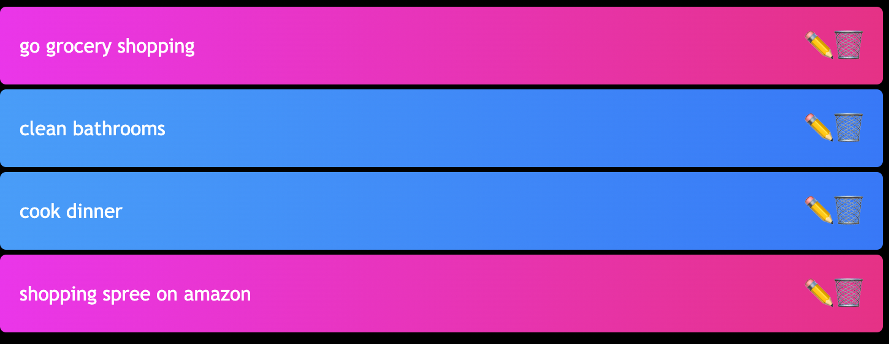
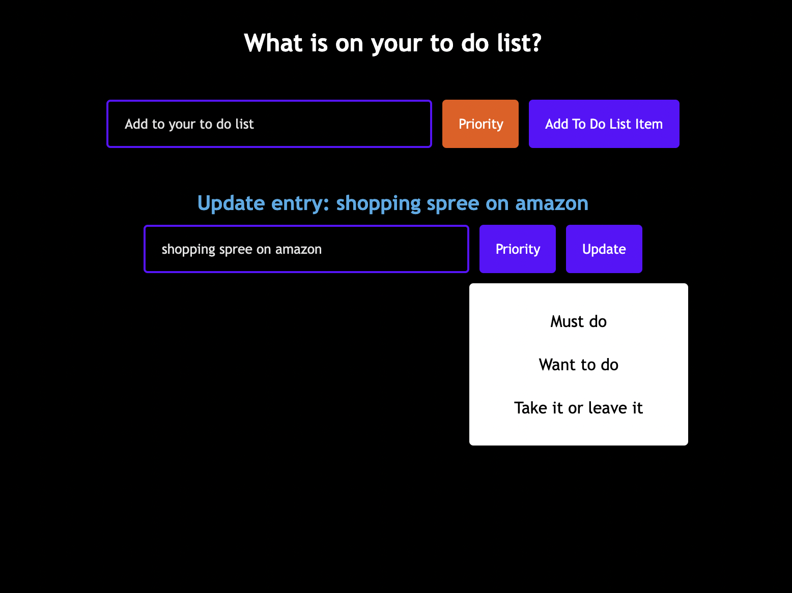

# React To Do List App

- React to do app that allows you to enter a to do list item.

- You are able to set the Priorty level of a to-do-list item.

- You are able see a list of all my to-do-list items after they are added, with colors that identify their priorty level.

- You are able to edit and delete to-do-list items.

# enter a to do + set priority

# see all to do's list

# click on the bin and pencil icon to delete or edit to do list

# edit your list or & update priority level

### Links

- Deploy Heroku Link:https://to-do-list--react--app.herokuapp.com
- GitHub Repo:https://github.com/emma4jesus/ToDoList-ReactApp

### License

Read more about the MIT License _[here](https://opensource.org/licenses/MIT)_.

---

### Questions

If you have any questions, please send me an email at: emmanuelajeanbaptiste1@gmail.com
